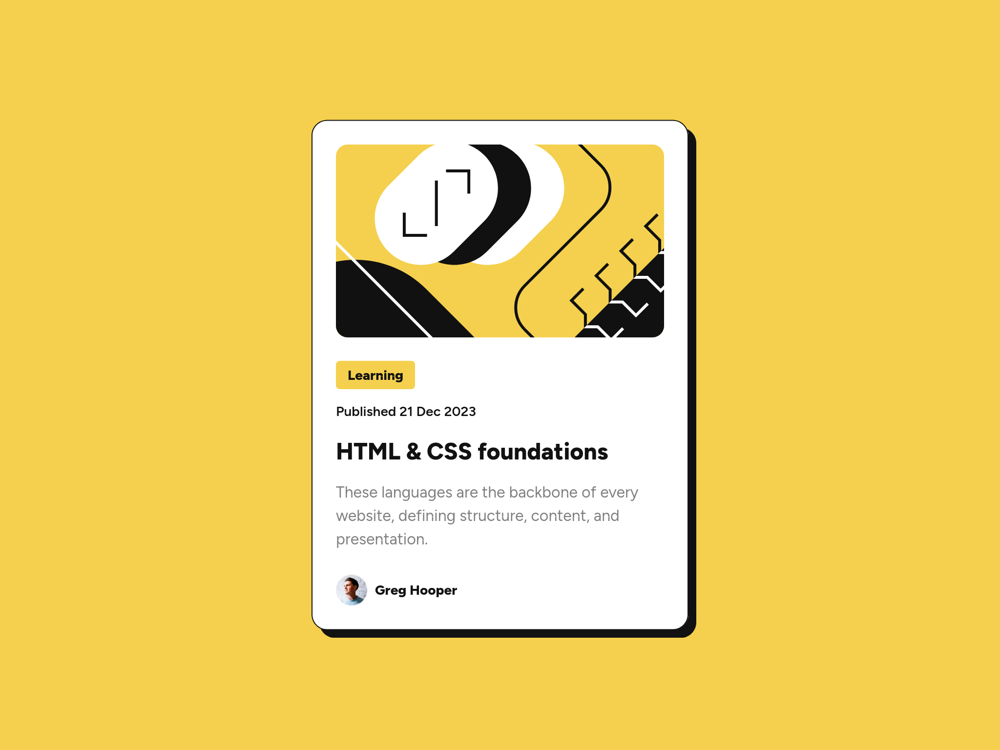

# Frontend Mentor - Blog preview card solution

This is a solution to the [Blog preview card challenge on Frontend Mentor](https://www.frontendmentor.io/challenges/blog-preview-card-ckPaj01IcS). Frontend Mentor challenges help you improve your coding skills by building realistic projects. 

## Table of contents

- [The challenge](#the-challenge)
- [Screenshot](#screenshot)
- [Live solution](#link)
- [Built with](#built-with)
- [Author](#author)

## The challenge

Users should be able to:

- See hover and focus states for all interactive elements on the page

## Screenshot

## Link

- Live Site URL: [live site URL](https://anar-sol.github.io/frontend-mentor-challenges/blog-preview-card/)

## My process

## Built with

- Semantic HTML5 markup
- Vanilla CSS
- Flexbox
- Mobile-first
- BEM CSS naming

## Author

- Frontend Mentor - [@anar-sol](https://www.frontendmentor.io/profile/anar-sol)
