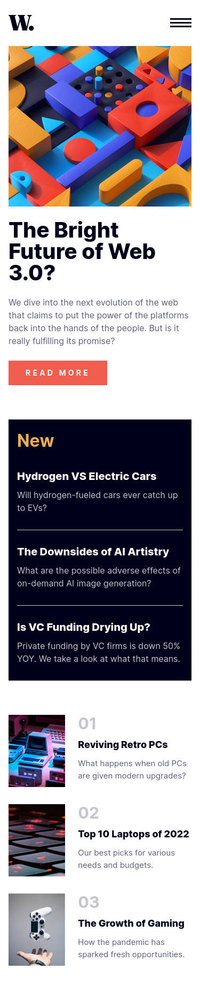

# Frontend Mentor - News homepage solution

This is a solution to the [News homepage challenge on Frontend Mentor](https://www.frontendmentor.io/challenges/news-homepage-H6SWTa1MFl). Frontend Mentor challenges help you improve your coding skills by building realistic projects. 

## Table of contents

- [Overview](#overview)
  - [The challenge](#the-challenge)
  - [Screenshots](#screenshots)
  - [Links](#links)
- [My process](#my-process)
  - [Built with](#built-with)
  - [What I learned](#what-i-learned)
  - [Continued development](#continued-development)
  - [Useful resources](#useful-resources)
- [Author](#author)

## Overview

### The challenge

Users should be able to:

- View the optimal layout for the interface depending on their device's screen size
- See hover and focus states for all interactive elements on the page

### Screenshots




### Links

- Solution URL: [Github repo](https://github.com/anar-sol/frontend-mentor-challenges/tree/master/news-homepage)
- Live Site URL: [News homepage](https://anar-sol.github.io/frontend-mentor-challenges/news-homepage/)

## My process

### Built with

- Vanilla HTML, CSS, and JS
- Semantic HTML5 markup
- BEM naming convention
- CSS custom properties
- Flexbox
- CSS Grid
- Accessibility
- Mobile-first workflow (except for the menu)
- Progressive enhancement

### What I learned

I used semantic HTML elements to implement the different components:

- I used [`<article>`](https://developer.mozilla.org/en-US/docs/Web/HTML/Element/article) elements for the article cards, as I considered them as independent content that could be displayed or reused elsewhere.
- To contain the different categories of articles, I used [`<section>`](https://developer.mozilla.org/en-US/docs/Web/HTML/Element/section) elements.

I structured the page with appropriate heading levels, some of them are accessible to screen reader only. Every `<section>` has a heading.

I tried to make the components as independent as possible. For that, I used the [BEM naming convention](https://getbem.com/introduction/) and divided the CSS and JS into multiple files, one for each component (with some exceptions).

To change the paddings, sizing, and other properties depending on viewport I didn't apply a different value for the property but changed a css custom property.

```css
:root {
    --logo-width: 3rem;
}

@media (min-width: 48rem) {
    :root {
        --logo-width: 4rem;
    }
}

.logo {
    width: var(--logo-width);
}
```

For accessibility:

- I implemented a skip-to-main link
- used aria-label for image only links and buttons
- used aria-label for the "read more" link
- implemented an accessible hamburger menu
- styled hover, active, and focus states to make visible
- kept a logical and natural tab order

I used JS to make the whole cards clickable while keeping the content selectable.

```js
const cards = document.querySelectorAll(".card");
cards.forEach(card => {
    card.addEventListener("click", () => {
        const mainLink = card.querySelector(".card__main-link");
        const isTextSelected = window.getSelection().toString();
        if (!isTextSelected && mainLink) {
            mainLink.click();
        }
    });
});
```

The main navigation panel can be closed with the button, by pressing the `ESC` key, and when clicking the overlay. The focus returns to the hamburger menu.

### Continued development

If I had more time to dedicate to this project

- I would refactor the CSS and make a better (and cleaner) use of the variables
- Try to find a solution to make the whole clickable cards more accessible to keyboard users and add an active state
- Change the colors to fix contrast issues.


### Useful resources

- To learn how to implement an accessible [clickable card](https://css-tricks.com/block-links-the-search-for-a-perfect-solution/#aa-method-4-sprinkle-javascript-on-the-second-method).
- To make an [accessible "Read more" link](https://www.visionaustralia.org/business-consulting/digital-access/blog/how-to-make-read-more-links-accessible).
- To make [image only links and buttons accessible](https://www.w3.org/WAI/tutorials/images/functional/). For [accessible icon buttons](https://www.sarasoueidan.com/blog/accessible-icon-buttons/).
- For [accessible SVGs](https://css-tricks.com/accessible-svgs/).
- Various resources to implement an [accessible skip-to-main link](https://webaim.org/techniques/skipnav/), make the [skip-to-main invisible by default](https://webaim.org/techniques/css/invisiblecontent/#skipnavlinks), [skip-to-main on web.dev](https://web.dev/learn/html/navigation/#skip-to-content-link), and [skip-to-main on css-tricks](https://css-tricks.com/how-to-create-a-skip-to-content-link/).
- How to make a component accessible to [screen readers only](https://css-tricks.com/inclusively-hidden/).
- Inspiration for making [a button controlled navigation menu](https://getbootstrap.com/docs/5.3/components/collapse/).
- Resources used for the [css reset](https://unpkg.com/tailwindcss@3.4.1/src/css/preflight.css).

## Author

- Frontend Mentor - [@anar-sol](https://www.frontendmentor.io/profile/anar-sol)
