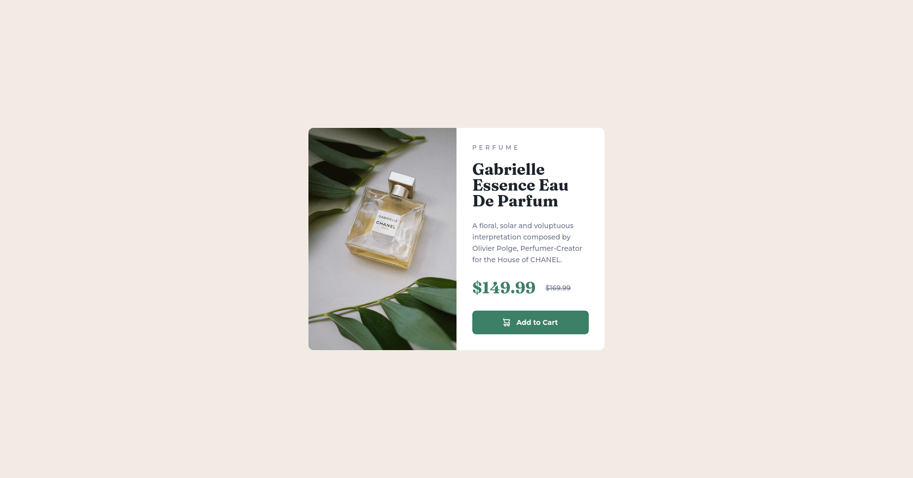

# Frontend Mentor - Product preview card component solution

This is a solution to the [Product preview card component challenge on Frontend Mentor](https://www.frontendmentor.io/challenges/product-preview-card-component-GO7UmttRfa). Frontend Mentor challenges help you improve your coding skills by building realistic projects. 

## Table of contents

- [The challenge](#the-challenge)
- [Screenshots](#screenshots)
- [Live solution](#link)
- [Built with](#built-with)
- [Author](#author)

## The challenge

Users should be able to:

- View the optimal layout depending on their device's screen size
- See hover and focus states for interactive elements

## Screenshots

## Link

- [Live Solution](https://anar-sol.github.io/frontend-mentor-challenges/product-preview-card-component/)

## Built with

- Semantic HTML5 markup
- Vanilla CSS
- Flexbox
- CSS Grid
- Mobile-first
- BEM CSS naming

## Author

- Frontend Mentor - [@anar-sol](https://www.frontendmentor.io/profile/anar-sol)
